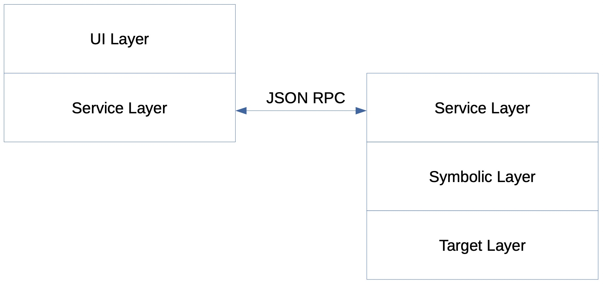
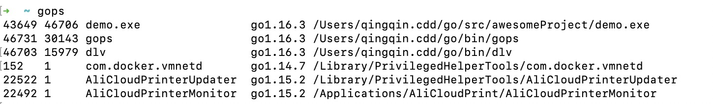
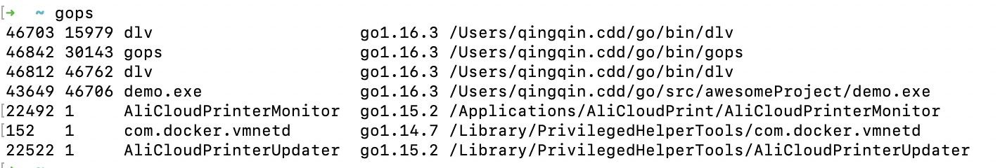
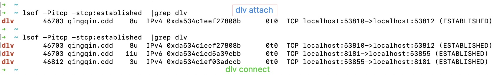
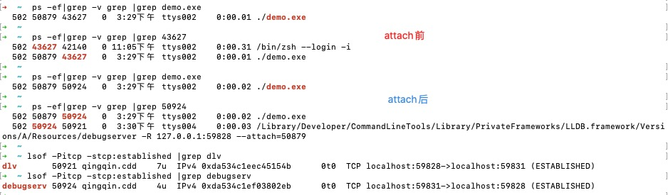

# Delve 设计
依然以 Mac 环境演示，go version go1.16.3 darwin/amd64

## 1.结构
开始之前，我们先了解下 delve 设计结构<sup>1</sup>

| /    |  layer | desc |
| :--: |  :--:  | :--: |
| 1    |  UI Layer | User Interfaces |
| 2    |  Symbolic Layer | knows about line numbers, types, variable names, etc. |
| 3    |  Target Layer | controls target process,doesn’t know anything about your source code. |

不过这是一个简化模型，在[Dlv 初步学习](./Dlv-learning.md#如何通信)中，我们了解到存在着一个 dvl 到 debugserver 的相互通信链路，在「Architecture of Delve slides」中 Delve 设计者们确实是这么设计的：



**疑问**：在没有 Goland、Gdlv 等等可视化用户界面时，Cmd Promt 充当了 UI Layer ？
我理解是这样。

## 2.实践观察
用实践解开疑惑

### 实践1：headless模式

1. 以  headless 模式 attach 目标进程

终端1中运行 `./demo.exe`，进程 PID 43649（获取[进程 PID](./Dlv-learning.md#attach正在运行的程序)），再新启终端2运行如下命令：
```
dlv --headless --listen=:8181 attach 43649
```

使用 `gops` 查看进程，记住 dlv attach 进程 PID **46703**，目标进程 demo.exe 的进程 PID **43694**，PPID **44706**


2. 连接上 8181 debug 会话

新启终端3运行如下命令：
```
dlv connect 127.0.0.1:8181
```

再次使用 `gops` 可以看到有了两个 dlv 进程，记住 dlv connect 进程 PID **46812**


3. 查看 dlv 进程的网络连接

通过 lsof 或 netstat 命令获取网络连接情况
```
lsof -Pitcp -stcp:established

netstat -v -p tcp |grep [pid]
```

在 `dlv attach` 而没有 `dlv connect` 时


在 `dlv connect` 后


记住我们在上面获取的 dlv 进程 PID，简单对应下：

- `dlv attach` 此时占用 53810 端口，连接到 53812 端口
- `dlv attach` 此时占用 8181 端口，连接到 53855 端口
- `dlv connect` 此时占用 53855 端口，连接到 8181 端口

那么 53812 端口由谁占用呢？ debugserv：


同时我们观察到 debugserver 的 PID 显示为 **46706** ，这与 demo.exe 进程的 PPID 46706 相同。

4. 梳理下链接

除了 8181 是我们指定外，其余端口都是 dlv 自行占用


### 实践2：非headless模式

1. 以  headless 模式 attach 目标进程

终端1中运行 `./demo.exe`，进程 PID 49264，再新启终端2运行 `dlv attach 49264`

2. 查看 dlv 进程的网络连接

dlv 进程（只有一个）和网络连接：


我们再次观察到 debugserver 的 PID **48330** 与 demo.exe 进程的 PPID 49330 相同。

3. 梳理下链接

- `dlv attach` 此时占用 57856 端口，连接到 87858 端口
- `debugserv` 此时占用 57858 端口，连接到 57856 端口


## 3.进程debugserv为何物

`ps -ef|grep debugserv` 得到进程信息，结合 delve 设计结构<sup>1</sup>一文，我们还可以猜测它和 lldb 有关。
```
/Library/Developer/CommandLineTools/Library/PrivateFrameworks/LLDB.framework/Versions/A/Resources/debugserver -R 127.0.0.1:59828 --attach=50879
```

为何 demo.exe 进程的父进程会是 debugserv？

- PID 是程序被操作系统加载到内存成为进程后动态分配的资源，它是唯一的；
- PPID 是 PPID是父进程号 parent process ID；
- 一个进程创建的另一个新进程称为子进程，创建子进程的进程称为父进程；
- 对于一个普通的用户进程，其父进程是执行它的 shell，例如 bash、zsh 等，多个 shell 会话窗口是不同的 shell 进程；
- 所有进程追溯其祖先最终会到进程号为1的进程上，这个进程为 init 进程；
- init 进程是 Linux 内核启动后第一个执行的进程；

观察 dlv attach 前后 demo.exe 进程 PPID 的变化：



attach 前后 demo.exe 的 PPID 发生了变化，从 zsh 进程变为 debugserv 进程。

同时我稍加观察可以发现 debugserv 进程的 PPID **50921** 恰巧是 dlv attach 的 PID 50921，我们大致猜测 debugserv 进程由 dlv 进程创建。

到这里，我们进一步猜测 debugserv 进程的参数作用：
*--attach=50879* 是 demo.exe 的进程 PID，*127.0.0.1:59828* 是 dlv attach 的监听地址。

在 Google 搜索 *Resources/debugserver -R* 关键词未果后，依据经验我猜测 *-R* 应该是某个关键词 *--r* 的缩写，于是调整关键词为 *lldb debugserver --r*，一条 *lldb reverse-connect* 相关记录令人眼前一亮，按照 *lldb reverse-connect* 关键词，我最终在 llvm org、github 中找到了答案。

*-R* 扭转了连接方向，由 debugserver 主动去连接 client 的地址<sup>[2]</sup>。
>--reverse-connect  
   Connect to the client instead of passively waiting for a connection. In this case, [host]:port denotes the remote address to connect to.

*-R* 即 *--reverse-connect*<sup>[3]</sup> 

## 4.End
到此我们围绕 [dlv 和 debug server 如何通信](./Dlv-learning.md#如何通信)的疑问对 delve 的设计结构进行了实践认识。

这个过程没有结合 delve 代码分析，从猜测到确认答案是通过一点点观察和翻文档，获取信息效率并不高，后面我们将以阅读代码的方式来理解 delve。

# REF

1.[Architecture of Delve slides](https://speakerdeck.com/aarzilli/internal-architecture-of-delve)

2.[https://lldb.llvm.org/man/lldb-server.html](https://lldb.llvm.org/man/lldb-server.html)

3.[llgs: add --reverse-connect support](https://github.com/llvm/llvm-project/commit/31bde322f374582d7106f0c847b0ff3b6b6d705b)