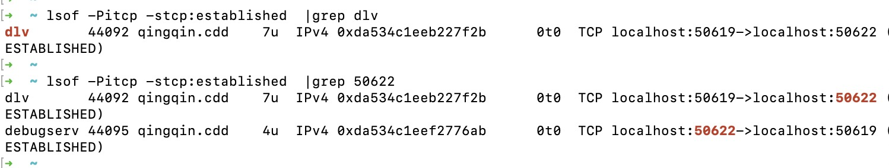
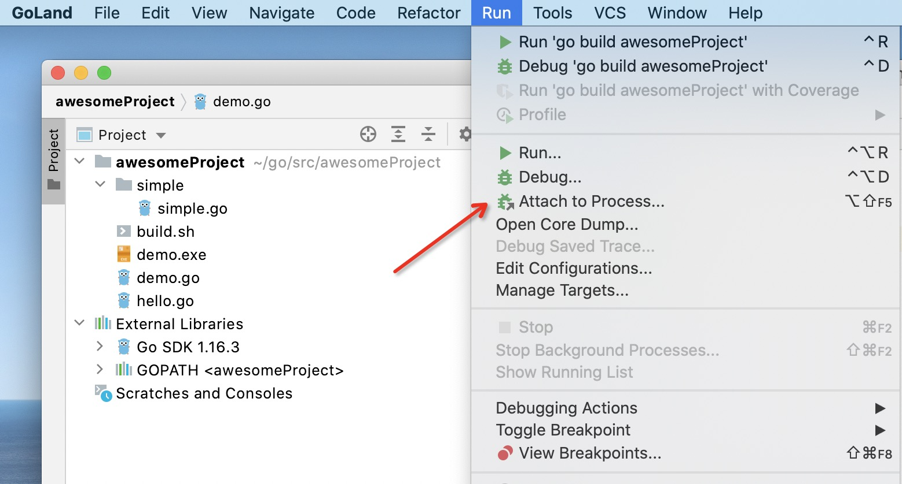
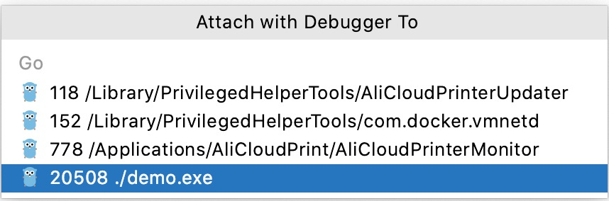
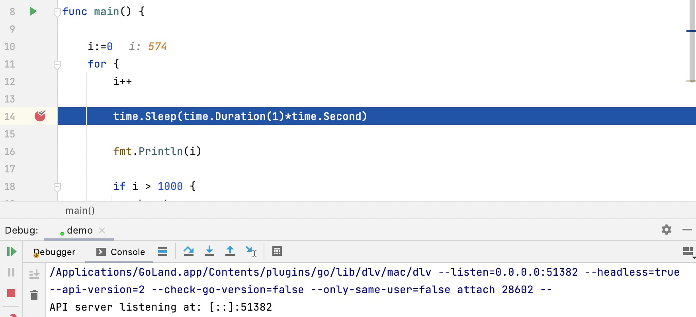

# dlv 快速开始

dlv 全称 [delve](https://github.com/go-delve/delve) ，它是一款面向 golang 语言的调试工具（图片来自 dlv 官网）。


以 Mac 环境演示，go version go1.16.3 darwin/amd64。

为降低 dlv 使用过程中的权限询问打扰，查看 DevToolsSecurity 当前状态 `DevToolsSecurity -status`，将其打开 `sudo /usr/sbin/DevToolsSecurity -enable`。

## 1.Install

1. 下载 dlv 代码并构建<sup>[1]</sup>
```shell
git clone https://github.com/go-delve/delve
cd delve
go install github.com/go-delve/delve/cmd/dlv
```
或者（go version 不低于 1.16）
```shell
go install github.com/go-delve/delve/cmd/dlv@latest
```

dlv 将安装在 GOBIN 目录，GOBIN 默认为 `$GOPATH/bin`，如 GOPATH 未设置则默认为 `$HOME/go/bin`，关于 [Go 环境变量配置](./Getting-started.md#环境变量)。

>$go help install  
Executables are installed in the directory named by the GOBIN environment
variable, which defaults to $GOPATH/bin or $HOME/go/bin if the GOPATH
environment variable is not set.

如果安装报错 `"https://proxy.golang.org/github.com/cosiner/argv/@v/v0.1.0.mod": dial tcp 172.217.160.113:443: i/o timeout` 设置下 GOPROXY 即可：

```shell
go env -w GOPROXY=https://goproxy.cn
```

2. 检测下 dvl 安装

在 GOBIN 目录下执行 dlv：

```shell
> ./dlv version
Delve Debugger
Version: 1.7.0
Build: $Id: e353a65161e6ed74952b96bbb62ebfc56090832b
```

3. 获取 dlv 帮助
```shell
./dlv -h
./dlv --help
```

4. 设置全局 dlv

因为 dlv 不在 `/usr/bin`、`/usr/local/bin` 下，所以每次运行 dlv 均要指定 GOBIN，我们设置全局 dlv 来代替

在 `~/.profile` 中添加一个别名：
```shell
alias dlv='$GOBIN/dlv'
```
再 source 以生效配置
```shell
source ~/.profile
```

当然，也可以在 `/usr/local/bin` 目录下创建一个链接指向 `$GOBIN/dlv`：
```shell
ln -s $GOBIN/dlv /usr/local/bin/dlv
```

## 2.Usage

上面我们已经体验了 version 命令和 -h 选项，dlv 支持的选项和命令远不止这些。

### Options

下面 Options 是全局级别的，通过 `dlv -h` 获取帮助，同时具体的 dlv command 也会有自己独有的 Options ，通过 `dlv [command] -h` 获取<sup>[2]</sup>。

```
--accept-multiclient               Allows a headless server to accept multiple client connections.
--allow-non-terminal-interactive   Allows interactive sessions of Delve that don't have a terminal as stdin, stdout and stderr
--api-version int                  Selects API version when headless. New clients should use v2. Can be reset via RPCServer.SetApiVersion. See Documentation/api/json-rpc/README.md. (default 1)
--backend string                   Backend selection (see 'dlv help backend'). (default "default")
--build-flags string               Build flags, to be passed to the compiler. For example: --build-flags="-tags=integration -mod=vendor -cover -v"
--check-go-version                 Checks that the version of Go in use is compatible with Delve. (default true)
--disable-aslr                     Disables address space randomization
--headless                         Run debug server only, in headless mode.
-h, --help                             help for dlv
--init string                      Init file, executed by the terminal client.
-l, --listen string                    Debugging server listen address. (default "127.0.0.1:0")
--log                              Enable debugging server logging.
--log-dest string                  Writes logs to the specified file or file descriptor (see 'dlv help log').
--log-output string                Comma separated list of components that should produce debug output (see 'dlv help log')
--only-same-user                   Only connections from the same user that started this instance of Delve are allowed to connect. (default true)
-r, --redirect stringArray             Specifies redirect rules for target process (see 'dlv help redirect')
--wd string                        Working directory for running the program.
```

### Command

`dlv attach` - Attach to running process and begin debugging.

`dlv connect` - Connect to a headless debug server.

`dlv core` - Examine a core dump.

`dlv dap` - [EXPERIMENTAL] Starts a headless TCP server communicating via Debug Adaptor Protocol (DAP).

`dlv debug` - Compile and begin debugging main package in current directory, or the package specified.

`dlv exec` - Execute a precompiled binary, and begin a debug session.

`dlv replay` - Replays a rr trace.

`dlv run` - Deprecated command. Use 'debug' instead.

`dlv test` - Compile test binary and begin debugging program.

`dlv trace` - Compile and begin tracing program.

`dlv version` - Prints version.

`dlv log` - Help about logging flags

`dlv backend` - Help about the --backend flag

## 3.实操dlv attach

`dlv attach` 默认暂停程序的执行，可设置 `--continue` 选项让 attach 不阻塞程序执行<sup>[5]</sup>。
> --continue   Continue the debugged process on start.

开启一个不暂停目标程序、无交互界面模式的 debug 会话，端口为 8181
```shell
dlv attach 16591 --continue --headless --accept-multiclient --listen=:8181
```

**注意**：指定 `--continue` 时必须搭配 `--headless`，未指定 `--listen` 时端口由系统分配

连接上已开启的 8181 会话
```shell
dlv connect 127.0.0.1:8181
```

**注意**：在 connect 上时目标进程即刻被暂停

### attach正在运行的程序

- 步骤1：编写一个 demo 程序
```go
package main

import (
	"fmt"
	"time"
)

func main() {
	i:=0
	for {
		i++
		time.Sleep(time.Duration(1)*time.Second)
		fmt.Println(i)
		if i > 1000 {
			break;
		}
	}
}
```

- 步骤2：编译&运行

编译 demo.go 为可执行程序 demo.exe，这里的 .exe 并无实际意义
```shell
go build -v -o demo.exe demo.go
```

运行 demo.exe
```shell
./demo.exe
```
- 步骤3：查看进程PID

使用 ps 查看进程 PID，第二列为 PID，如 16250
```
ps -ef|grep -v grep |grep demo.exe
```

或者使用 gops<sup>[4]</sup> 查看进程 PID，第一列为 PID
```
gops |grep demo.exe
```

- 步骤4：attach 进程

以非 headless 模式 attach 到 16250 进程上，并出现 dlv 用户交互界面：
```shell
>dlv attach 16250
Type 'help' for list of commands.
(dlv)
```

**注意**：在 attach 上时目标进程即刻被暂停

#### 如何通信
非 headless 模式下 dlv command 如何到达 debug server 的，他们交互或通信机制是什么？

~~也是通过 debug 端口，只是非 headless 模式下，指定 `-l` 或 `--listen` 无效，debug 端口随机分配~~

存在一个 debugserv 进程，跨进程间通过端口的方式。在非 headless 模式下指定 `-l` 或 `--listen` 无效，不会开启 debug 端口。


上面使用的命令：
```
lsof -Pitcp -stcp:established | grep dlv 
lsof -Pitcp -stcp:established | grep [port]
```

### 修改程序运行状态
dlv 交互界面支持以命令的方式调试程序。

1.新增一个断点  
```
break demo.go:14
```

2.查看全部断点  
```
bp
```
可以看到存在额外的断点，因为 dlv 默认对 `/usr/local/go/src/runtime/panic.go` 施加了断点。

3.继续程序直到下一个断点  
```
continue
```

4.修改变量的值  
```
set i=0
```

5.打印变量的值  
```
print i
```

6.清除全部断点  
```
clearall
```
但它不会清除 dlv 默认施加的 panic 断点。

## 4.More

### Goland集成Attach
对于 remote attatch，我们可以在 Goland 中集成 gops <sup>[3]</sup> 工具。
gops 由 Google 官方提供，用于查看和诊断正在运行的 go 程序进程<sup>[4]</sup>。

>gops is a command to list and diagnose Go processes currently running on your system.

首先安装 gops：
```shell
go get -t github.com/google/gops/
```

之后重启 Goland，工具栏出现 **Run | Attach to Process**(`⌥⇧F5`)：


运行 `./demo.exe` 再尝试下 `⌥⇧F5`：


此时 demo.go 上断点命中了，Debug Console 打印出 dlv attach 提示：


这说明 Attach to Process 至少做了以下几件事：
- 获取指定 go 进程的PID
- 以 headless 模式 attach 指定 PID
- connect 到 debug 会话

这里留一个疑问：为什么 Attach to Process 在没有指定 `--continue` 下，目标进程没有暂停，除非命中断点，而 dlv attach 则需要明确指定？

# REF

1.[Delve Installation](https://github.com/go-delve/delve/tree/master/Documentation/installation)

2.[Using Dlv](https://github.com/go-delve/delve/blob/master/Documentation/usage/dlv.md)

3.[Attach to running Go processes with the debugger](https://www.jetbrains.com/help/go/attach-to-running-go-processes-with-debugger.html)

4.[google gops](https://github.com/google/gops/)

5.[Allow attaching to a process without pausing the execution](https://github.com/go-delve/delve/issues/245)