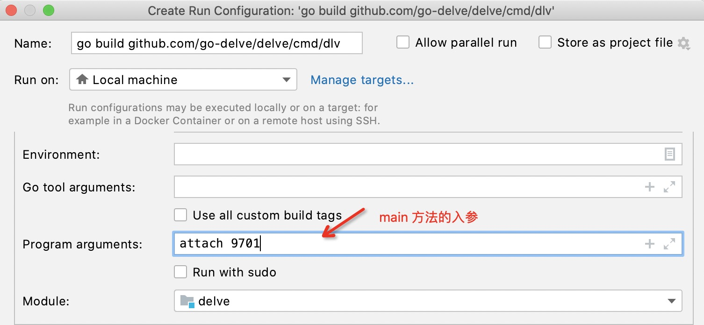
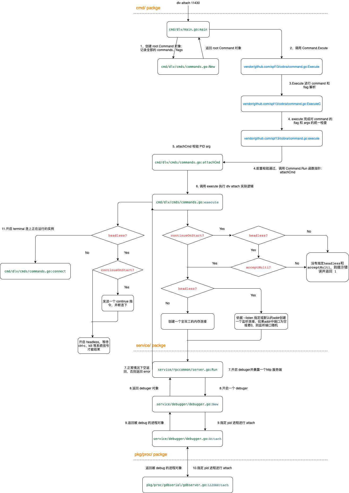

# Delve 启动过程解析

承接上一篇 [阅读 Devle 代码](./Dlv-Code-Reading#pkg/proc/gdbserial)，对 `dlv attach` 进行详解。

## 提前准备
环境参数如下：

| 软件 | 版本 | 
| :--: |  :--:  | 
| Go | go1.16.3 darwin/amd64 | 
| Mac | Darwin Kernel Version 19.5.0 x86_64 |
| delve | Commit ID aaed14ff |
| dlv | 1.7.0 |

Goland 打开 delve 代码，debug 运行 `cmd/dlv/main.go` 的 main 方法，配置程序入参 Program arguments：

我们开始对 debuger 的 debug 之旅，对 `dlv attach` 命令的执行进行跟踪。

## 总体流程

以 `dlv attach` 为示例，解读下 delve 代码是如何处理这一命令的。

## 分步拆解

### 一
`cmd/dlv/main.go`  dlv 程序入口，方法无参数无返回值。

我们向程序传递的入参通过 `os.Args` 获取，`os.Args` 与 Java 中 `public static main(String[] args)` 的 args 类似，它是一个数组，第一个元素为进程名，第二个元素为第一个入参，依次后推。

# REF

