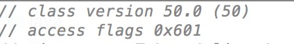
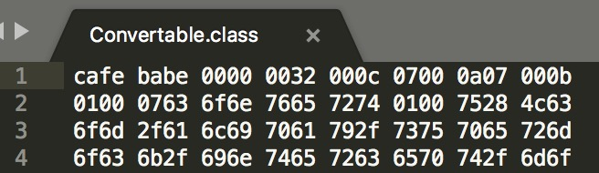

# 查看 class 文件的编译版本

## MANIFEST.MF 文件

JAR files support a wide range of functionality, including electronic signing, version control, package sealing, and others. What gives a JAR file this versatility? The answer is the JAR file's manifest.

The manifest is a special file that can contain information about the files packaged in a JAR file. By tailoring this "meta" information that the manifest contains, you enable the JAR file to serve a variety of purposes.

### Build-Jdk 显示编译器版本

Build-Jdk: ${java.version}

The Build-Jdk does not take toolchains configuration into account. It is the same JDK version as running the Maven instance.

可以使用如下 shell 脚本查看 .m2 仓库中使用 jdk8 编译的 jar 文件

```
jarList=$(find /.m2/respository -name '*.jar')
for file in $jarList; do
    jdkVersion=$(unzip -p $file META-INF/MANIFEST.MF | grep Build-Jdk)
    if [[ $jdkVersion =~ "1.8"]]; then
        echo $file $jdkVersion >> jdk8.txt
    fi
done
```

## Maven Compiler Plugin

Sometimes when you may need to compile a certain project to a different version than what you are currently using. The javac can accept such command using -source and -target. The Compiler Plugin can also be configured to provide these options during compilation.

### 如何指定 -source、-target

For example, if you want to use the Java 8 language features (-source 1.8) and also want the compiled classes to be compatible with JVM 1.8 (-target 1.8), you can either add the two following properties, which are the default property names for the plugin parameters:

```
<properties>
    <maven.compiler.source>1.8</maven.compiler.source>
    <maven.compiler.target>1.8</maven.compiler.target>
</properties>
```
or configure the plugin directly:

```
 <plugin>
    <groupId>org.apache.maven.plugins</groupId>
    <artifactId>maven-compiler-plugin</artifactId>
    <version>3.6.0</version>
    <configuration>
        <source>1.6</source>
        <target>1.6</target>
    </configuration>
</plugin>
```

 **Note:** Merely setting the target option does not guarantee that your code actually runs on a JRE with the specified version. The pitfall is unintended usage of APIs that only exist in later JREs which would make your code fail at runtime with a linkage error. 

## ClassFile Construct

类文件(.class文件扩展名)是包含Java字节码 ByteCode的文件，可以在Java虚拟机上执行，每个类文件包含了一个类，接口或者模块（Java 9）的定义

Java程序（.java 文件）可以通过 Java compiler 生成字节码文件，其他基于JVM的语言也都可以通过自己的编译器生成字节码文件，例如Scala，Groovy等

### 查看 ClassFile 的 bytecode 版本

有很多方式可以查看 class 的内容，依据 jdk 的规范定义，class 文件的首部包含有字节码版本信息，这里简要提及一下三种方式。

1. ByteCode Viewer

借助 IDEA 的 ByteCode Viewer 插件可查看 class 文件的字节码版本，第一行 class version 50 即为该 class 文件的字节码版本。



2. sublime

通过 sublime 打开 class 文件，可以看到第一行第四列即 0x32，即十进制的 50。



3. javap

javap -v Convertable.class


## bytecode version 和 jdk version 的映射关系

| /    |  major | jdk  |
| :--: |  :--:  | :--: |
| 版本  |  52    | 1.8  |
| 版本  |  51    | 1.7  |
| 版本  |  50    | 1.6  |
| 版本  |  49    | 1.5  |

# Reference

[Working with Manifest Files: The Basics](https://docs.oracle.com/javase/tutorial/deployment/jar/manifestindex.html)

[Manifest](http://maven.apache.org/shared/maven-archiver/examples/manifest.html)

[Setting the -source and -target of the Java Compiler](http://maven.apache.org/plugins/maven-compiler-plugin/examples/set-compiler-source-and-target.html)

[IDEA下查看Java字节码-ByteCode Viewer](https://www.jianshu.com/p/b87f7e564c98)

[https://www.jianshu.com/p/93318f387d04](https://www.jianshu.com/p/93318f387d04)