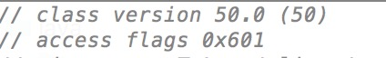
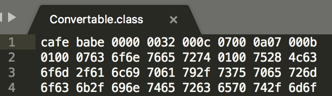
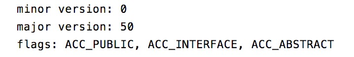

# 有关 class 文件的编译版本

## MANIFEST.MF 文件

JAR files support a wide range of functionality, including electronic signing, version control, package sealing, and others. What gives a JAR file this versatility? The answer is the JAR file's manifest.

The manifest is a special file that can contain information about the files packaged in a JAR file. By tailoring this "meta" information that the manifest contains, you enable the JAR file to serve a variety of purposes<sup>[1]</sup>.

### Build-Jdk 显示编译器版本

Build-Jdk: ${java.version}

The Build-Jdk does not take toolchains configuration into account. It is the same JDK version as running the Maven instance<sup>[2]</sup>.

可以使用如下 shell 脚本查看 .m2 仓库中使用 jdk8 编译的 jar 文件。

```
jarList=$(find /.m2/respository -name '*.jar')
for file in $jarList; do
    jdkVersion=$(unzip -p $file META-INF/MANIFEST.MF | grep Build-Jdk)
    if [[ $jdkVersion =~ "1.8"]]; then
        echo $file $jdkVersion >> jdk8.txt
    fi
done
```

## Maven Compiler Plugin

Sometimes when you may need to compile a certain project to a different version than what you are currently using. The javac can accept such command using -source and -target. The Compiler Plugin can also be configured to provide these options during compilation<sup>[3]</sup>.

We can use the javac tool and its options to read Java class and interface definitions and compile them into bytecode and class files<sup>[6]</sup>.

### 如何指定 -source、-target

For example, if you want to use the Java 8 language features (-source 1.8) and also want the compiled classes to be compatible with JVM 1.8 (-target 1.8), you can either add the two following properties, which are the default property names for the plugin parameters<sup>[3]</sup>:

```
<properties>
    <maven.compiler.source>1.8</maven.compiler.source>
    <maven.compiler.target>1.8</maven.compiler.target>
</properties>
```
or configure the plugin directly:

```
 <plugin>
    <groupId>org.apache.maven.plugins</groupId>
    <artifactId>maven-compiler-plugin</artifactId>
    <version>3.6.0</version>
    <configuration>
        <source>1.6</source>
        <target>1.6</target>
    </configuration>
</plugin>
```

 **Note:** Merely setting the target option does not guarantee that your code actually runs on a JRE with the specified version. The pitfall is unintended usage of APIs that only exist in later JREs which would make your code fail at runtime with a linkage error<sup>[3]</sup>. 

## ClassFile Format

类文件（.class 文件扩展名）是包含 Java 字节码 ByteCode 的文件，可以在 Java 虚拟机上执行<sup>[7]</sup>，每个类文件包含了一个类、接口或者模块（Java 9<sup>[5]</sup>）的定义

Java 程序（.java 文件）可以通过 Java compiler 生成字节码文件，其他基于 JVM 的语言也都可以通过自己的编译器生成字节码文件，例如 Scala，Groovy 等。

### 查看 ClassFile 的字节码版本

这里字节码版本指 class 文件中 major、minor 字段的值。

major、minor 共同决定了 class 文件格式的版本，对于给定的 major M，minor m，则 class 文件格式的版本为 M.m，对于某一版本的 class 文件格式，必须在 JVM 所能支持的范围，即最小支持版本 <= M.m <= 最大支持版本，否则 JVM 将会抛出 UnsupportedClassVersionError 错误<sup>[5]</sup>。

依据 JVM 规范定义，class 文件的首部包含有字节码版本信息。对于如何查看 class 文件，这里简要提及一下三种方式。

1. ByteCode Viewer

借助 IDEA 的 ByteCode Viewer 插件<sup>[4]</sup>可查看 class 文件的字节码版本，第一行 class version 50 即为该 class 文件的字节码版本。



2. sublime

通过 sublime 打开 class 文件，可以看到第一行第四列即 0x32，即十进制的 50。



3. javap

java 自带的 javap 反编译工具可以查看 class 文件。

javap -v Convertable.class



## bytecode version 和 jdk version 的映射关系

| /    |  major | jdk  |
| :--: |  :--:  | :--: |
| 版本  |  52    | 1.8  |
| 版本  |  51    | 1.7  |
| 版本  |  50    | 1.6  |
| 版本  |  49    | 1.5  |

# Build-Jdk、-target、major 的区别与联系

Build-Jdk：MANIFEST.MF 中说明 maven 运行时 jdk 版本，取值为 java.version（默认 1.8），不影响 class 文件格式的版本。

-source、-target：是 javac 命令的 options，maven 可以将 -source、 -target 传递给 javac，影响 class 文件格式的版本。

major、minor：class 文件格式版本，如果超过 JVM 支持范围，JVM 加载 class 文件时抛出 UnsupportedClassVersionError 错误。

如果源代码中使用了高版本 jdk 特性，通过 -source、-target 指定低版本来编译代码，可能产生 JDK 兼容性问题，详见 [JDK 兼容性](./JDK-Compatibility.md)

# Reference

1.[Working with Manifest Files: The Basics](https://docs.oracle.com/javase/tutorial/deployment/jar/manifestindex.html)

2.[Manifest](http://maven.apache.org/shared/maven-archiver/examples/manifest.html)

3.[Setting the -source and -target of the Java Compiler](http://maven.apache.org/plugins/maven-compiler-plugin/examples/set-compiler-source-and-target.html)

4.[IDEA下查看Java字节码-ByteCode Viewer](https://www.jianshu.com/p/b87f7e564c98)

5.[The Java® Virtual Machine Specification Java SE 9 Edition](https://docs.oracle.com/javase/specs/jvms/se9/jvms9.pdf)

6.[Standard Options for javac](https://docs.oracle.com/javase/9/tools/javac.htm#GUID-AEEC9F07-CB49-4E96-8BC7-BCC2C7F725C9__STANDARDOPTIONSFORJAVAC-7D3D9CC2)

7.[Java class file](https://en.wikipedia.org/wiki/Java_class_file)