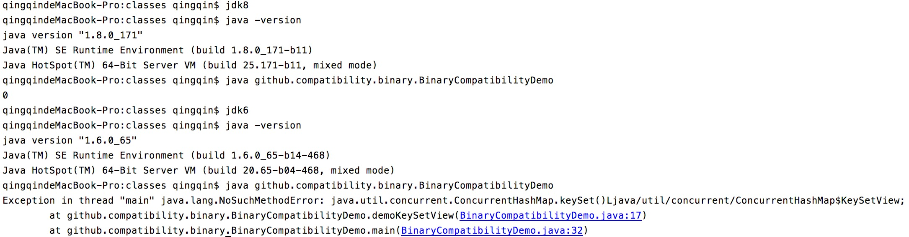

# 应用代码中的 Java 兼容性问题

本文内容主要有 Java 兼容性的分类、常见案例、规避引入不兼容问题的方法，同时基于开源项目定制一个探测任意三方 jar 的 Java 兼容性的工具。本文不讨论应用 APIs 变化对上下游应用产生的兼容性，而是关注应用编译、运行在不同版本 JVM 时可能引入的 Java 兼容性问题。

## 一、什么是 Java 的兼容性

兼容性可以从两个方向上考虑<sup>[4]</sup>：
+ 向后兼容（backward compatibility）：新版本软件可以运行在低版本的环境中，也称为向下兼容（downward compatibility）
+ 向前兼容（forward compatibility）：低版本软件可以运行在高版本的环境中，也称为向上兼容（upward compatibility）

通常，Java 兼容性多指向后兼容，主要包括三种：源码（source）、二进制（binary）和运行时行为（behavioral），同时 Java 提供的 APIs、Tools（如 javac）也涉及兼容性<sup>[5]</sup><sup>[6]</sup><sup>[8]</sup>：

1. 源码兼容性（source compatibility）：源码兼容性涉及 Java 源代码编译为 .class 文件，包括映射是否可能、生成的类文件是否合适。
2. 二进制兼容性（binary compatibility）：在 Java 规范中二进制兼容性被定义保持无链接错误的能力，有时也被称为非源码兼容性。通常，低版本 JDK 编译出来的 class 文件可以在同版本以及更高版本 JVM 上运行，而不能被更低版本 JVM 正确地加载和链接。
3. 行为兼容性（behavioral compatibility）：行为兼容性是指在运行时代码执行表达出的语义应该是相同或者等价的。
4. APIs 兼容性：Java 提供的 API 的所有变化，其中 API 的移除或者签名变化会导致 Java 程序在新版 JDK 中无法编译或运行时错误。 
5. Tools 兼容性：Java 提供的工具，例如编译工具 javac，这些工具在 Java 发展过程中参数可能会发生变化。

在 Oracla 官方文档中 Java 提供的 APIs 包含 Java SE APIs 和 JDK APIs 等，Java SE 提供的 APIs 所在模块名以 java 开头，JDK 提供的 APIs 所在的模块名以 jdk 开头<sup>[10]</sup>（Java 9 引入了模块概念，低版本 Java 中可以从包名上区分这些 APIs）。

关于 Java 全部组件可以看 *Description of Java Conceptual Diagram*<sup>[11]</sup>，如下图：


### 1.1 应用程序中是如何引入了 Java 兼容性问题

在实际代码开发工作中，一种情况，我们无法保证程序开发、运行时的 JDK 版本相一致，例如开发阶段在源码中引用 Java8 特性中的类或方法并编译为 Java6 格式的类文件，不兼容问题会导致程序运行时时低版本 JVM 中抛出 LinkageError 错误；又例如，应用的编译和运行版本为 Java6，但是意外引入了某个编译版本为 Java8 的三方依赖的，则 JVM 运行期间会 UnsupportedClassVersionError 错误（class 文件格式的版本号限制了它可以在哪些 Java 版本上运行）。

另一情况，尽管 JDK 对于 APIs 兼容性策略包括不可破坏二进制兼容性、不可引入源码的不兼容、管理行为兼容性的变化<sup>[9]</sup>，但一些高版本特性的实现带来的变化会破坏兼容性，包括但是不限于应用源码中使用了 `@deprecated` 标记的类或者方法，那么应用程序在迁移升级 JDK 时就可能遇到不兼容问题，例如 Java 9 中删除了 sun.misc.Unsafe 的 monitorEnter、monitorExit 和 tryMonitorEnter 方法被<sup>[12]</sup>。

Oracle 提供了 Java 兼容性指导手册，如 *[Compatibility Guide for JDK 8](https://www.oracle.com/java/technologies/javase/8-compatibility-guide.html)*，我们可以通过这些文档了解 Java 在不同版本间的兼容性变化。

关于代码开发、编译和运行阶段涉及 Java & JDK 版本的相关内容参考 *[Class 文件格式版本](https://github.com/elseifer/elseifer.github.io/blob/202004/jdk-compatibility/ClassFile-Version.md)*，本文中提及的类文件（格式）版本、class 文件（格式）版本、字节码版本含义相同，均是指编译生成的 .class 文件首部的 major、minor 字段的值。

## 二、Java 兼容性的若干案例 

下面创建一个示例工程 [compatibility-demo](https://github.com/elseifer/compatibility-demo.git) 演示应用中可能引入的 Java 不兼容问题，本文涉及的基本软件环境为 JDK8 和 Maven 3.6.3，并根据需要会调整代码运行时的 JDK 为 6/7/8/14 版本。


### 2.1 源码兼容性

Java 编译器的工作包括将抽象的名称映射到具体的名称，特别是把源代码中出现的简单的限定名映射为 class 文件中的二进制名称，源代码兼容性涉及源代码到 class 文件的映射，不仅包括这种映射是否可能，而且还包括生成的 class 文件是否合适。

这里演示 Java 版本升级对 Java 应用源码的影响，构造两个场景：
+ JDK7 开发的代码在 Java8 下编译失败；
+ JDK6 开发的代码在 Java8 下编译成功，但是程序运行异常，需要对源代码进行修改；

示例代码位于 compatibility-demo 的 [source 分支](https://github.com/elseifer/compatibility-demo/blob/source/src/main/java/github/compatibility/source)。

### javac 的不兼容
如下代码：
```java
public class SampleClass {
    static class Baz<T> {
        public static List<Baz<Object>> sampleMethod(Baz<Object> param) {
            return null;
        }
    }
    private static void bar(Baz arg) {
        Baz element = Baz.sampleMethod(arg).get(0);
    }
}
```
在 Java7 下编译成功：


但在 Java8 会编译失败：


### Proxy.getProxyClass 

Java8 中实现 non-pulic 接口的 java.lang.reflect.Proxy 代理类是 non-pulic、final 和 not abstract，而在 Java8 之前，实现 non-pulic 接口的代理类是 pulic、final 和 not abstract，如果调用者和 non-public 代理类不在同一个包下，在运行时出现 java.lang.IllegalAccessException 异常。

```java
public class SourceCompatibilityDemo {
    public static void main(String[] args) throws Exception {
        ClassLoader cl = SourceCompatibilityDemo.class.getClassLoader();
        SourceCompatibilityDemo sc = new SourceCompatibilityDemo();
        sc.demoPublic(cl);
        sc.demoDefault(cl);
    }
    public void demoPublic(ClassLoader cl) throws Exception {
        //PulicInteface 是 public 的
        final PulicInteface pulicInteface = new PublicIntefaceImpl();
        Class proxyClass = Proxy.getProxyClass(cl, pulicInteface.getClass().getInterfaces());
        // proxy 类自带一个包含 InvocationHandler 参数的构造器
        Constructor<PulicInteface> constructor = proxyClass.getDeclaredConstructor(InvocationHandler.class);
        PulicInteface instanceProxy = constructor.newInstance(new InvocationHandler() {
            @Override
            public Object invoke(Object proxy, Method method, Object[] args) throws Throwable {
                System.out.print("hello, ");
                return method.invoke(pulicInteface, args);
            }
        });
        instanceProxy.method();
    }
    public void demoDefault(ClassLoader cl) throws Exception {
        //PulicInteface 是 default 的
        final DefaultInterfaceImpl defaultInterface = new DefaultInterfaceImpl();
        Class proxyClass = Proxy.getProxyClass(cl, defaultInterface.getClass().getInterfaces());
        // proxy 类自带一个包含 InvocationHandler 参数的构造器
        Constructor constructor = proxyClass.getDeclaredConstructor(InvocationHandler.class);
        //JDK 8 需要
        //constructor.setAccessible(true);
        Object instanceProxy = constructor.newInstance(new InvocationHandler() {
            @Override
            public Object invoke(Object proxy, Method method, Object[] args) throws Throwable {
                System.out.print("hello, ");
                //这个在 JDK6/8 上都是需要的
                method.setAccessible(true);
                return method.invoke(defaultInterface, args);
            }

        });
        Method method = proxyClass.getMethod("method",null );
        //JDK 8 需要
        //method.setAccessible(true);
        method.invoke(instanceProxy,null);
    }
}
```
在 Java6 下运行正常：


在注释 constructor.setAccessible(true) 和 method.setAccessible(true)时，在 Java8 下运行将会抛出异常：


添加 constructor.setAccessible(true); 和 method.setAccessible(true)后，在 Java8 下则运行正常：


### 2.2 二进制兼容性

二进制兼容性可以解释为当某个类型发生变化，如果先前存在的没有发生过链接错误的二进制文件可以继续无错误的链接，那么这个类型对于先前存在的二进制文件就是二进制兼容的。

除了 Java 发布报告已知的二进制不兼容点，高版本 Java 对于低版本 Java 是二进制兼容的，由低版本 Java 编译器编译的 class 文件可以正确运行在高版本 Java 上运行，反之高版本 Java 编译器编译低 class 文件将不能在低版本 Java 上运行。例如，JVM 规范中 Java7 的 class 文件版本是 51（引入了 invokedynamic 字节码），该版本的 class 文件是无法在 Java6 上运行的，JVM 会抛出 UnsupportedClassVersionError 错误<sup>[13]</sup>。

假设一个方法改变了实现，抛出异常而不是正确的返回结果，对于客户端类而言，这不是二进制兼容性问题，客户端类还是可以正确链接的，同样向接口添加方法也不是二进制兼容性问题，根据旧版本的接口编译的类文件仍将链接到新版本的接口，尽管类没有新方法的实现。如果在运行时调用新方法，则抛出 AbstractMethodError；如果未调用新方法，则可以使用现有方法而不会发生意外（向接口添加方法是源代码不兼容，如果重新编译类文件会失败）。

这里构造两个代码中会出现的二进制不兼容场景，Java 版本间的二进制兼容案例可以参考 *[JDK 9 Release Notes: Removed APIs, Features, and Options](https://www.oracle.com/java/technologies/javase/9-removed-features.html)*

+ Java8 开发的代码（引入高版本特性的）编译为 Java6 格式并运行于 Java6 上；
+ Java6 开发的代码中依赖了 Java7 版本的 Jar，运行于 Java6 上；

示例代码位于 compatibility-demo 的 [master 分支](https://github.com/elseifer/compatibility-demo/blob/master/src/main/java/github/compatibility/binary)。

### ConcurrentHashMap.keySet

在 Java8 中 ConcurrentHashMap 的 keySet 方法的返回类型不再是 Set，而是 KeySetView 类，该类在 Java6、7 中都是不存在。这里我们故意使用 Java8 开发代码，并编译成 Java6 版本（字节码版本为 50），然后将代码在 Java6 上运行。

```java
public class BinaryCompatibilityDemo {
    public void demoKeySetView() {
        ConcurrentHashMap<String, String> concurrentHashMap = new ConcurrentHashMap<String, String>();
        Set<String> strings = concurrentHashMap.keySet();
        System.out.println(strings.size());
        //这一行是为了其他的演示，和 keySet 无关
        long count = concurrentHashMap.mappingCount();
    }
    public static void main(String[] args) {
        new BinaryCompatibilityDemo().demoKeySetView();
    }
}
```

```xml
<plugin>
    <groupId>org.apache.maven.plugins</groupId>
    <artifactId>maven-compiler-plugin</artifactId>
    <version>3.8.1</version>
    <configuration>
        <!---source 必须低于或等于 -target 的值必须一致，需要在 JVM6 上运行，所以设置为 1.6-->
        <source>1.6</source>
        <target>1.6</target>
    </configuration>
</plugin>
```

执行 `mvn clean package -Dmaven.test.skip` 编译 compatibility-demo 应用，在 target/classes 目录下我们可以找到编译产物：


在 target/classes 目录下，切换 Java 版本运行代码 `java github.compatibility.binary.BinaryCompatibilityDemo`，在 Java8 下 BinaryCompatibilityDemo 输出结果 0，但是在 Java6 下抛出 NoSuchMethodError 错误（LinkageError 的子类）。Java6 版本（字节码版本 50）格式的 `BinaryCompatibilityDemo.class` JVM8 下可以正常运行，但在 JVM6 是无法运行。



未经过反编译的二进制内容会更加直观明显的展示出问题所在：


keySet 的方法签名（这里包括返回类型的）在类版本 50 下是不可能存在的。

### Apache StringUtils

在 pom.xml 引入 3.7 版本的 commons-lang3，它的编译版本为 Java7（字节码版本 51），并在演示代码中使用 StringUtils 工具类。

```xml
<dependency>
    <groupId>org.apache.commons</groupId>
    <artifactId>commons-lang3</artifactId>
    <version>3.7</version>
</dependency>
```

```java
public class ApacheUtilsDemo {
    public static void main(String[] args) {
        boolean flag = StringUtils.equals("aaa", "bbb");
        System.out.println(flag);
    }
}
```
执行 `mvn clean package -Dmaven.test.skip` 编译 compatibility-demo 应用，在 target/classes 目录下我们可以找到编译产物：


在 target/classes 目录切换 Java 版本运行代码 `java -classpath  .:/Users/qingqin/.m2/repository/org/apache/commons/commons-lang3/3.7/commons-lang3-3.7.jar  github.compatibility.binary.ApacheUtilsDemo`，在 Java8 下 ApacheUtilsDemo 输出结果 false，但是在 Java6 下抛出 UnsupportedClassVersionError 错误（LinkageError 的子类）


## 三、如何规避代码中引入运行时 Java 兼容性问题

从上面的 [ConcurrentHashMap#keySet](#concurrenthashmapkeyset) 案例知道，设置 `-target` 选项并不能保证代码可以正确地在某一版本的 JRE 上运行，一些较晚出现的 APIs 会在代码运行时产生连接错误，为了避免这个问题，我们可以配置 Java 编译器的引导类路径来匹配目标 JRE 或者使用 Animal Sniffer Maven Plugin 插件。同样的，设置 `-source` 选项也不能保证代码可以在某一版本的 JDK 上编译通过，为了解决这个问题，我们需要设置与运行 Maven 不同的特定版本的 JDK 来编译代码<sup>[1]</sup>。

继续以 compatibility-demo<sup>[7]</sup> 为例，如何规避引入 Java 兼容性问题。

### 3.1 Animal Sniffer Maven Plugin

The Animal Sniffer Plugin<sup>[2]</sup> 可以用于构建 APIs 签名以及通过对照 APIs 签名对 class 进行检查。对于源码编译阶段发现 Java APIs 不兼容是比较便利的，但对已经打包的 jar 还需要我们的动手能力来自定义（这在稍后内容也会讨论）。

#### 3.1.1 如何配置

为了对照 APIs 签名检查我们的应用，必须在 `pom.xml` 中配置需要参考的签名，例如：
配置 java1.6 的签名作为参考，在 mvn 编译代码后手动执行 `animal-sniffer:check` 可以进行签名检查

```xml
<plugin>
    <groupId>org.codehaus.mojo</groupId>
    <artifactId>animal-sniffer-maven-plugin</artifactId>
    <version>1.16</version>
    <!-- 配置 jdk1.6 的签名 -->
    <configuration>
        <signature>
            <groupId>org.codehaus.mojo.signature</groupId>
            <artifactId>java16</artifactId>
            <version>1.0</version>
        </signature>
    </configuration>
</plugin>
```

或者参考一下方式把检查工作加入到 mvn 构建过程中：

```xml
<plugin>
    <groupId>org.codehaus.mojo</groupId>
    <artifactId>animal-sniffer-maven-plugin</artifactId>
    <version>1.16</version>
    <!-- jdk1.6 的签名 -->
    <configuration>
        <signature>
            <groupId>org.codehaus.mojo.signature</groupId>
            <artifactId>java16</artifactId>
            <version>1.0</version>
        </signature>
    </configuration>
    <!-- compile 阶段自动执行 mvn animal-sniffer:check -->
    <executions>
        <execution>
            <id>animal-sniffer-check</id>
            <phase>compile</phase>
            <goals>
                <goal>check</goal>
            </goals>
        </execution>
    </executions>
</plugin>
```

#### 3.1.2 使用效果

执行 `mvn clean compile` 编译代码，Maven 将在 check 阶段报错，animal-sniffer 插件检测出不兼容的 Java Apis 引用，例如 Java8 中新增的 ConcurrentHashMap.KeySetView 类。


### 3.2 maven-compiler-plugin 指定 JDK Tools

这里涉及 Maven Toolchains 的运用<sup>[3]</sup>，在应用构建过程中 Maven 会使用 JDK 来执行每个阶段：编译源代码、生成 Javadoc、运行单元测试等，每个 Maven 插件可能使用不同的 JDK Tools，例如 `javac`、`javadoc`。通过 Toolchains，我们可以指定 Maven 插件使用的 JDK Tool 的路径，并区别于 Maven 实例自身运行的 JDK。

与 `-target`、`-source` 不同（本质为使用固定版本JDK的编译器来生成不同字节码版本的 class 文件），通过 maven-compiler-plugin 指定 JDK Tools 路径（包括 `javac`）更类似于切换编译环境的 JDK 版本，也能更好的避免引入 JDK 不兼容问题。

#### 3.2.1 如何配置
示例代码位于 compatibility-demo 的 [javacpath 分支](https://github.com/elseifer/compatibility-demo/blob/javacpath/pom.xml)，其中 ${JAVA_7_HOME} 可以在 pom.xml 或者 setting.xml 中指定。</br>
```xml
<plugin>
    <groupId>org.apache.maven.plugins</groupId>
    <artifactId>maven-compiler-plugin</artifactId>
    <version>3.8.1</version>
    <configuration>
        <verbose>true</verbose>
        <fork>true</fork>
        <executable>${JAVA_7_HOME}/bin/javac</executable>
        <compilerVersion>1.7</compilerVersion>
    </configuration>
</plugin>
```

#### 3.2.2 使用效果

运行 `mvn clean compile --settings ./settings-os.xml -X` ，其中 `-X` 可以将 Maven 的 DEBUG 信息打印出来，帮助我们查看 maven-compiler-plugin 的运行参数：


</br>由于示例代码中使用 Java8 API，maven-compiler 编译抛出错误：


### 3.3 小结

经过 Demo 实践上述 3.1 和 3.2 小节的内容，适当使用 Maven 插件可以避免我们在代码中引入 Java 兼容性问题（主要是二进制兼容性），但我们日常的研发环境中代码编译过程大部分都在统一的构建平台进行，一些外部环境是 Maven 插件不能控制的，构建平台升级 JDK 也可能将 Java 兼容性问题引入到应用中。时刻保持代码编译、打包和运行时的 JDK 版本一致是解决应用引入 Java 兼容性问题的最好方式<sup>[8]</sup>。

## 四、如何探测应用引入的 jar 潜在 Java 兼容问题

不论是设置编译时 JDK 还是使用 Sniffer 插件，都默认了一个前提，即我们拥有源代码并可以修改代码的构建配置与流程，但如果我们在应用中更新或者引入一个三方依赖（其他组织发布的 jar），最经典的案例莫过于，基于 Spring 开发的应用避免不了升级 Spring 版本或者相关依赖，我们有必要清楚这些 jar 是否潜在 Java 兼容性问题，这里我就以 Java APIs 为例，讨论下如何检测三方 Jar 是否存在 Java APIs、类文件格式的不兼容（源码和二进制兼容性的一部分）。

### 4.1 改造 animal-sniffer

通过阅读 animal-sniffer-maven-plugin 的源码，我发现它是基于 ASM 对字节码进行检查，加之有过 ASM 开发工具的经验，于是我设想把参考的 APIs 签名默认限制为 Java APIs 签名，调整检测目标为任意三方 jar 和 .class 文件路径来对它进行改造。在[我的 github](https://github.com/elseifer) 上可以获取 [animal-sniffer-jar-with-dependencies](https://github.com/elseifer/animal-sniffer/blob/enhance-signature-checker/animal-sniffer/src/main/java/org/codehaus/mojo/animal_sniffer/enhanced/EnhancedSigChecker.java) 的源代码，作为 animal-sniffer 变种，它完整包含所有依赖、可脱离 Maven 环境独立运行，可检查第三方 jar 而无需源代码，同时修复了一些 NPE 问题。

### 4.2 实践

实验下 animal-sniffer-jar-with-dependencies 的功能，以上文提到的 [ConcurrentHashMap#keySet](#concurrenthashmapkeyset) 案例的编译产物作为测试目标，运行 `java -jar animal-sniffer-jar-with-dependencies.jar /Users/qingqin/git/compatibility-demo/target/classes -v 6` 

其中 `-i` 用于忽略一些包路径，一般可以把自身以及无需关注的依赖包忽略来减少干扰；`-v` 用于设置期望的 Java 版本，并使用该版本的 Java APIs 签名作为参考；

示例运行结果：</br>


和上文 3.1.2 部分的效果类似，animal-sniffer-jar-with-dependencies 检测也出 Java6 格式的 .class 文件中出现了不兼容的签名引用，包括 Java8 中新增的 ConcurrentHashMap.KeySetView 类、Optional 类、签名不兼容的 KeySetView ConcurrentHashMap.keySet 方法、新增的 ConcurrentHashMap.mappingCount 方法。

animal-sniffer-jar-with-dependencies 可以检查第三方依赖的 Java 兼容性问题，但是局限于 Java APIs 变化或编译格式导致的源码和二进制兼容性问题，并不适用于全部类型的 Java 兼容性问题检查。

## 五、总结

本文讨论了应用中的 Java 兼容性，涉及 Java 兼容性分类和案例、并对应给出解决方案，同时实验性质的开发 [animal-sniffer-jar-with-dependencies](https://github.com/elseifer/animal-sniffer/tree/enhance-signature-checker) 工具，用于检查 jar 中存在的源码不兼容。

1. 如果应用发布的 jar 会被其他应用在低版本 JVM 上运行，需要测试与研发环境的 JDK 和最低运行 JVM 版本相一致，或者参考本文第三部分的内容，保证代码构建无兼容性问题；
2. 如果应用引入其他外部依赖，在无法确定该 jar 是否可以在应用基线的 JVM 版本上运行时，则可以参考 `animal-sniffer-jar-with-dependencies` 工具对 jar 进行兼容性（主要是源码和二进制兼容性）探测；

Java 兼容性是宽泛的话题，不可能依赖单一手段解决或者规避，更需要研发规范、评审机制和测试手段协同。

# Reference

1.[Setting the -source and -target of the Java Compiler](http://maven.apache.org/plugins/maven-compiler-plugin/examples/set-compiler-source-and-target.html)

2.[animal-sniffer-maven-plugin](http://www.mojohaus.org/animal-sniffer/animal-sniffer-maven-plugin/usage.html)

3.[Compiling Sources Using A Different JDK](http://maven.apache.org/plugins/maven-compiler-plugin/examples/compile-using-different-jdk.html)

4.[BINARY COMPATIBILITY FOR LIBRARY AUTHORS](https://docs.scala-lang.org/overviews/core/binary-compatibility-for-library-authors.html)

5.[Compatibility Guide for JDK 8](https://www.oracle.com/java/technologies/javase/8-compatibility-guide.html)

6.[Kinds of Compatibility](https://wiki.openjdk.java.net/display/csr/Kinds+of+Compatibility)

7.[Java 兼容性的演示代码 compatibility-demo](https://github.com/elseifer/compatibility-demo.git)

8.[Java compatibility, Apache Maven and Jenkins Best Practices](https://support.cloudbees.com/hc/en-us/articles/360020783632-Java-compatibility-Apache-Maven-and-Jenkins-Best-Practices?mobile_site=true)

9.[Compatibility & Specification Review](https://wiki.openjdk.java.net/display/csr)

10.[Java® Platform, Standard Edition & Java Development Kit Version 9 API Specification](https://docs.oracle.com/javase/9/docs/api/overview-summary.html)

11.[Java Platform Standard Edition 8 Documentation](https://docs.oracle.com/javase/8/docs/)

12.[JDK 9 Release Notes: Removed APIs, Features, and Options](https://www.oracle.com/java/technologies/javase/9-removed-features.html)

13.[Java SE 7 and JDK 7 Compatibility](https://www.oracle.com/java/technologies/compatibility.html)