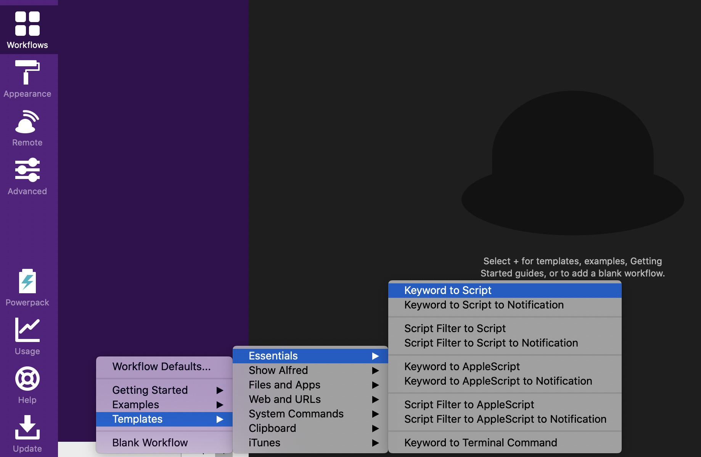
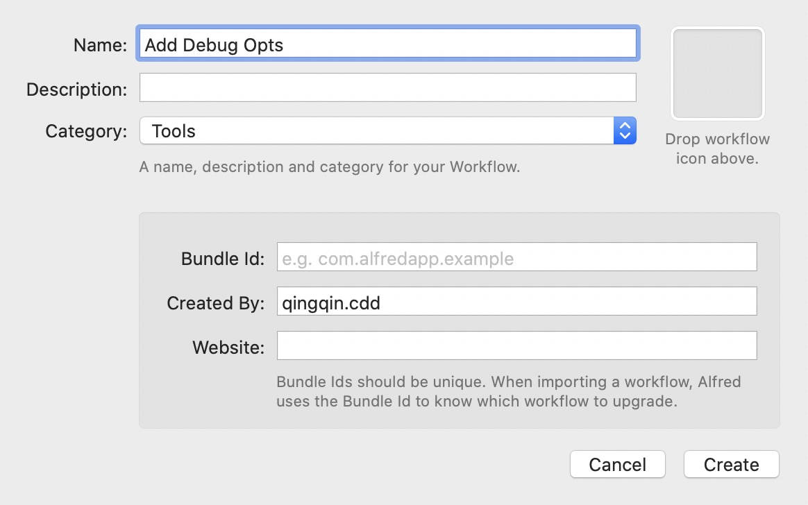
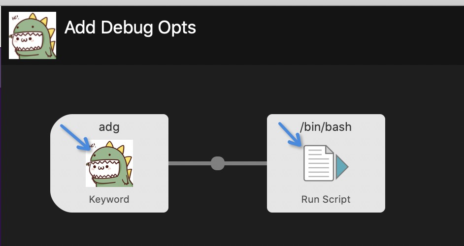

# 懒人添加debug参数

## 故事：懒人添加 debug 参数
当我们需要临时在测试服务器上调试代码时，我们一般不太情愿修改代码或者变更基线来新增 debug 参数，可以通过
`ps -ef|grep java` 找到对应 Java 进程，复制出来进程信息，例如：
```
/Library/Java/JavaVirtualMachines/jdk1.8.0_171.jdk/Contents/Home/bin/java -jar demo-1.0.0-executable.jar
```
杀掉旧的进程后再使用 nohup 后台启动 Java 进程：
```
nohup /Library/Java/JavaVirtualMachines/jdk1.8.0_171.jdk/Contents/Home/bin/java -agentlib:jdwp=transport=dt_socket,server=y,suspend=n,address=8000 -jar demo-1.0.0-executable.jar &>out.log &
```

不过这一过程依然不够懒，它需要人工操作如下步骤：
1. 在 bash 等终端上复制需要的 Java 进程信息；
2. 把进程信息粘贴在 Sublime 等文本编辑器中；
3. 小心翼翼的添加上 nohup、debug 等参数；
3. 把修改后信息粘贴在 bash 等终端上回车执行；

其中 2、3 步骤不够简洁，尤其是第 3 步简直是一次指尖苦力，我们可以借助 Alfred workflows 在粘贴板中替换 2、3 步。

## Alfred 
Alfred 是 Mac 下一款效能工具，提供便捷搜索、唤起程序、粘贴板等功能，这里介绍编写一个 Alfred workflows 插件来提高调试程序的效率。

### 自定义 Alfred Workflows

+ 快递门：`Preferences -> Workflows -> + -> Templates -> Essentials -> Keyword to Script`


+ 命名我们自己的插件：


+ 设置关键词：双击箭头所指位置，添加 keyword 以快速唤起我们的插件，双击 Run Script 编写脚本： 

例如我设置的关键词为 `adg`，在 Alfred 搜索中输入 `adg` 就会出现该插件：


+ 自定义脚本：懒人添加debug等参数
```Shell
query=($1)
len=${#query[@]}
result=""
start=false
add=false
for ((idx=0; idx<len; ++idx)); do
    param=${query[idx]}
    #中间件隐去一些增加健壮性的判断代码
    if [ "$add" == "false" ]; then
       result="$result ${param} -agentlib:jdwp=transport=dt_socket,server=y,suspend=n,address=8000 "
       add=true
    else 
       result="$result ${param} "
    fi
done
result="$result &>out.log &"
echo -n $result | pbcopy
```

+ 小试 adg：  
唤出 Alfred 搜索输入 `adg` ，键入一次空格，在搜索框中粘贴进程信息，敲下回车，此时，你的粘贴板中最新一次记录已经是添加 debug 的进程信息啦！

## 课外：不同 Java 版本的 Debug 参数
对于 Java5 以上版本，debug 参数：
`-agentlib:jdwp=transport=dt_socket,server=y,suspend=n,address=8000`  
而 Java5 及更低版本，dubug 参数：
`-Xdebug -Xrunjdwp:transport=dt_socket,server=y,suspend=n,address=8000`

# Ref
1.[java-remote-debugg](https://stackoverflow.com/questions/138511/what-are-java-command-line-options-to-set-to-allow-jvm-to-be-remotely-debugged?answertab=votes#tab-top)
