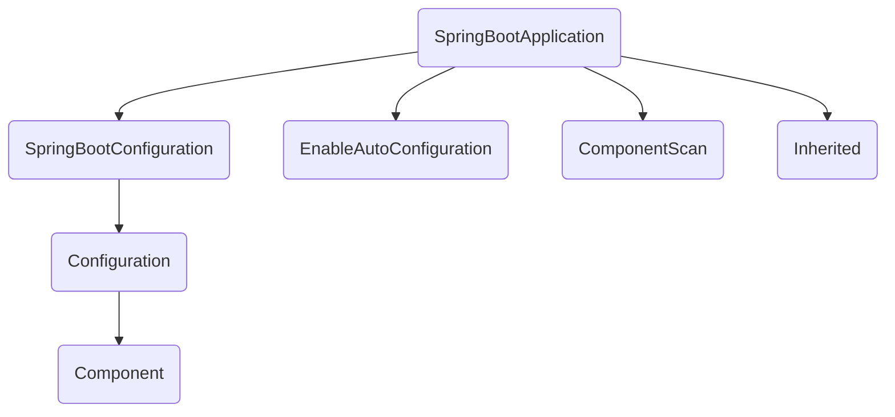

# Configuration 注解

## Configuration 注解的作用

从 Spring3.0 开始，`@Configuration` 可用于定义配置类，可替换 xml 配置文件，配置类中声明了一个或多个被 @Bean 注解的方法，Spring 容器会处理这些方法以构建 bean 定义和处理 bean 的请求。  
配置类会被 AnnotationConfigApplicationContext 或 AnnotationConfigWebApplicationContext （web 环境）处理<sup>1</sup>，SpringBoot Web 环境下由 AnnotationConfigServletWebServerApplicationContext 处理配置类。

### 什么是 Spring 配置类

Spring 配置类用来注册 bean，它效果与 xml 文件是一样的，只是创建 Spring IoC 容器的方式不同：
```java
//通过xml文件创建springIOC容器
ApplicationContext applicationContext = new ClassPathXmlApplicationContext("/spring-beans.xml");
//通过配置类创建springIOC容器
ApplicationContext applicationContext = new AnnotationConfigApplicationContext(BeanConfig.class);
```

如果一个类中有以下任意注解之一就属于配置类：  
- 类上有 `@Configuration` 注解  
- 类上有 `@Compontent` 注解  
- 类上有 `@CompontentScan` 注解  
- 类上有 `@Import` 注解  
- 类上有 `@ImportResource` 注解  
- 类中有 `@Bean` 标注的方法

判断一个类是否为一个配置类，可以看一下 `org.springframework.context.annotation.ConfigurationClassUtils#isConfigurationCandidate` 方法，Spring 中处理这个过程会循环进行，直到完成所有配置类的解析及所有bean的注册。 

这里提及下 `@Configuration` 是被原型注解 `@Component` 所标记的，即 `@Configuration` 所注解的类也会被自动检测（auto-detection）处理的。

### Configuration 处理器
ConfigurationClassPostProcessor 负责解析和处理（更具体的讲是 postProcessBeanDefinitionRegistry 方法）被 `@Configuration` 注解的类。

> BeanFactoryPostProcessor used for bootstrapping processing of `@Configuration` classes.  
Registered by default when using `<context:annotation-config/>` or `<context:component-scan/>`. Otherwise, may be declared manually as with any other BeanFactoryPostProcessor.  
This post processor is priority-ordered as it is important that any Bean methods declared in `@Configuration` classes have their corresponding bean definitions registered before any other BeanFactoryPostProcessor executes.

这里先埋下一个知识点： ConfigurationClassPostProcessor 需要配置 `<context:annotation-config/>` 、`<context:component-scan/>`，或者手动声明 `<bean class='org.springframework.context.annotation.ConfigurationClassPostProcessor'/>`。

#### 处理的顺序
ConfigurationClassPostProcessor 首先会判断在 ApplicationContext 中的 bean 是否被 @Configuration 注解标记，然后使用 ConfigurationClassParser 来解析 @Configuration。ConfigurationClassPostProcessor 解析 @Configuration 的大致流程：
  1. 使用ConfigurationClassUtils.checkConfigurationClassCandidate检查BeanDefinition是否@Configuration注解标记
  2. 对@Configuration进行排序
  3. 使用ConfigurationClassParser解析@Configuration注解的信息
  4. 使用ConfigurationClassBeanDefinitionReader解析BeanDefinition

</br>其中 ConfigurationClassUtils.checkConfigurationClassCandidate 的判断逻辑与下列代码类似，AnnotatedElementUtils.isAnnotated 递归遍历所有注解：
```java
//TestApplication 是启动类
AnnotatedElementUtils.isAnnotated(TestApplication.class, Configuration.class.getName());
```

前文提到了，被 @Configuration 注解的类是被视为配置类的，但为什么 SpringBootApplication 启动类会被当做配置类呢？ 这得益于 SpringBootConfiguration 注解。

#### SpringBootConfiguration 注解

看的它的定义：
```java
@Target(ElementType.TYPE)
@Retention(RetentionPolicy.RUNTIME)
@Documented
@Configuration
public @interface SpringBootConfiguration {}
```

在 SpringBoot 设计中 SpringBootConfiguration 可用来代替 Configuration，而它在使用 SpringBootApplication 时会被自动带入。

`@SpringBootApplication` 由如下几个注解构成：


即一个 SpringBootApplication 注解具备 Configuration、ComponentScan、EnableAutoConfiguration 三者的功能：注册Bean、组件自动扫描、自动配置。

#### 何时被处理 

ConfigurationClassPostProcessor 又由谁来调用呢？  
这里以 SpringBoot 为例，具体是哪个 ApplicationContext 是由 `org.springframework.boot.SpringApplication#createApplicationContext` 判断并创建。

```java
protected ConfigurableApplicationContext createApplicationContext() {
  Class<?> contextClass = this.applicationContextClass;
  if (contextClass == null) {
    try {
      switch (this.webApplicationType) {
      case SERVLET:
        contextClass = Class.forName(DEFAULT_SERVLET_WEB_CONTEXT_CLASS);
        break;
      case REACTIVE:
        contextClass = Class.forName(DEFAULT_REACTIVE_WEB_CONTEXT_CLASS);
        break;
      default:
        contextClass = Class.forName(DEFAULT_CONTEXT_CLASS);
      }
    }
    catch (ClassNotFoundException ex) {
      throw new IllegalStateException(
          "Unable create a default ApplicationContext, "
              + "please specify an ApplicationContextClass",
          ex);
    }
  }
  return (ConfigurableApplicationContext) BeanUtils.instantiateClass(contextClass);
}
```

随后 ApplicationContext 在 `org.springframework.context.support.AbstractApplicationContext#invokeBeanFactoryPostProcessors` 中触发 `ConfigurationClassPostProcessor#postProcessBeanDefinitionRegistry`的调用。


## ComponentScan 注解

这里填下前文的一个知识点：ConfigurationClassPostProcessor 是需要配置的，例如在 xml 中添加 `<context:component-scan/>` 元素，但是不是仅能通过 xml 配置呢? 答案自然是否定的。

ComponentScan 注解，这里引用下它的注释：
>Configures component scanning directives for use with @Configuration classes. Provides support parallel with Spring XML's <context:component-scan> element.  
Note that the `<context:component-scan>` element has an annotation-config attribute; however, this annotation does not. This is because in almost all cases when using @ComponentScan, default annotation config processing (e.g. processing @Autowired and friends) is assumed. Furthermore, when using AnnotationConfigApplicationContext, annotation config processors are always registered, meaning that any attempt to disable them at the @ComponentScan level would be ignored.

[基于java的配置](https://docs.spring.io/spring-framework/docs/current/reference/html/core.html#beans-java)文档中提到 `@ComponentScan` 注解可以代替 `<context:component-scan/>` 配置。

可以知道 `@ComponentScan` 注解同样会注册 Annotation Config 相关的处理器，再结合前文中提及 `@SpringBootApplication` 同时被 `@SpringBootConfiguration` 和 `@ComponentScan` 两个注解所标记，这就可以理解在使用 SpringBoot 的过程中，我们通常无需关心 ConfigurationClassPostProcessor 的配置了。

### EnableAutoConfiguration 注解
EnableAutoConfiguration 注解用于激活自动配置（auto-configuration），由 SpringBoot 中提供的，简单理解 `@Configuration` 标识了 Spring 配置类，`@ComponentScan` 告诉 Spring 扫描哪些配置类，而 `@EnableAutoConfiguration` 则告诉 Spring 可以装配或者不装配哪些配置类。
我理解这三者分别表述了：是什么？ 有什么？ 用什么？

### 再谈 SpringBootApplication 注解

```java
@SpringBootApplication(scanBasePackages={}, 
  exclude = {DataSourceAutoConfiguration.class, DataSourceTransactionManagerAutoConfiguration.class, HibernateJpaAutoConfiguration.class},)
public class SpringBootTestApplication {}
```
scanBasePackages 属性对应 ComponentScan 的 basePackages 属性，exclude 属性对应 EnableAutoConfiguration 的 exclude 属性，这就是简单的实现了 ComponentScan、EnableAutoConfiguration 的组件扫描和自动配置的能力。

## 扫描配置类的其他方式

不论是 xml 或者配置类均是 ConfigurationClassPostProcessor 等处理的，配置类的扫描是按照 `<context:component-scan/>` 和 `@ComponentScan` 的 basePackages 属性值来取得扫描路径，从而扫描出 classpath 下所有需要解析的配置类。

如果需要被 Ioc 容器管理的 Bean 的路径不在 SpringBoot 的包扫描路径下怎么办呢，即如何加载第三方的 Bean 呢？

### 方式1：spring.factories

一种类似 spi 方式来引入配置类：spring.factories，该文件位于 classpatch:META-INF 目录中，里面的内容如下：

```properties
org.springframework.boot.autoconfigure.EnableAutoConfiguration=\
  elseifer.example.service.MyAutoConfiguraion

org.springframework.context.ApplicationContextInitializer=\
  org.springframework.boot.context.ContextIdApplicationContextInitializer
``` 
它不单单可以指定配置类，还可以指定其他 Spring 提供的扩展类，例如 ApplicationContextInitializer 等等。

### 方式2：@Import

在 SpringBoot Application 启动类（或者配置类）上使用 @Import 注解，它的等价于 `<import/>`

```java
@Import({MyConfig.class})
@SpringBootApplication
public class SpringBootTestApplication {...}
```

额外提及下 `@ImportResource`，同 Import 的使用，它的作用近似于 `<import/>` 用于加载 xml 配置。

```java
@ImportResource({"classpath*:test/META-INF/example/*.xml"})
@SpringBootApplication
public class SpringBootTestApplication {...}
```

## End
到此，我们介绍了配置类、配置类的注解及其原理等内容，简单回顾：
1. 配置类可以代替 xml 来注册 Bean，使用 `@Configuration` 等注解声明配置类；
    - `@Configuation` 等价于 `<Beans></Beans>`
    - `@Bean` 等价于 `<Bean></Bean>`
    - `@ComponentScan` 等价于 `<context:component-scan/>`
2. 配置类由 ConfigurationClassPostProcessor 负责解析；
3. 使用 `@ComponentScan` 时 SpringBoot 将默认注册 ConfigurationClassPostProcessor；
4. 第三方或者非默认路径的配置类需要引入时，可以使用 spring.factories、`@Import`；

## REF
1.[Spring Framework Doc](https://docs.spring.io/spring-framework/docs/current/reference/html/core.html)  
2.[componentscan&enableautoconfiguration](https://www.baeldung.com/spring-componentscan-vs-enableautoconfiguration)
3.[Aggregating @Configuration classes with @Import](https://docs.spring.io/spring-javaconfig/docs/1.0.0.M4/reference/html/ch04s03.html)