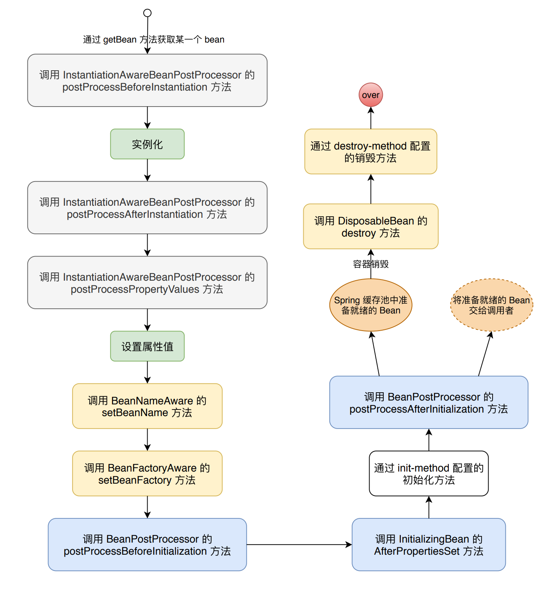

# IoC 容器的设计

BeanFactory 接口：定义了 IoC 容器规范，包括 getBean 基本方法（可以从容器中获得 Bean），但并不给出具体实现 ；

ApplicationContext 接口：应用上下文，一方面，实现 BeanFactory 接口体系的 ListableBeanFactory、AutowireCapableBeanFactory 接口，具备了 IoC 容器的基本功能；另一方面。通过实现 MessageSource、ResourceLoader、ApplicationEventPublisher 接口，为容器附加了更高级的特性。

WebApplicationContext 接口：为了在 Web 环境使用而设计，WebApplicationContext 实现 ApplicationContext、ThemeSource 接口

# Bean 的生命周期

1. bean 的初始化
    ```markdown
    a.调用一系列的 aware 接口；
    b.执行 BeanPostProcessor 的 postProcessBeforeInitialization方法；
    c.Bean 实现了 InitializingBean 接口，则执行 afterPropertiesSet 方法；
    d.在 BeanDefinition 中通过 init-method 属性指定了初始化方法，则执行（注意该方法如果和 “afterPropertiesSet” 同名则不执行，如果 “afterPropertiesSet” 抛出异常时 init-method 也会不执行）
    e.执行 BeanPostProcessor 的 postProcessAfterInitialization方法；
    ```


2. aware 接口


3. BeanPostProcessor

    [Spring Bean 的初始化](https://segmentfault.com/a/1190000014105687)
