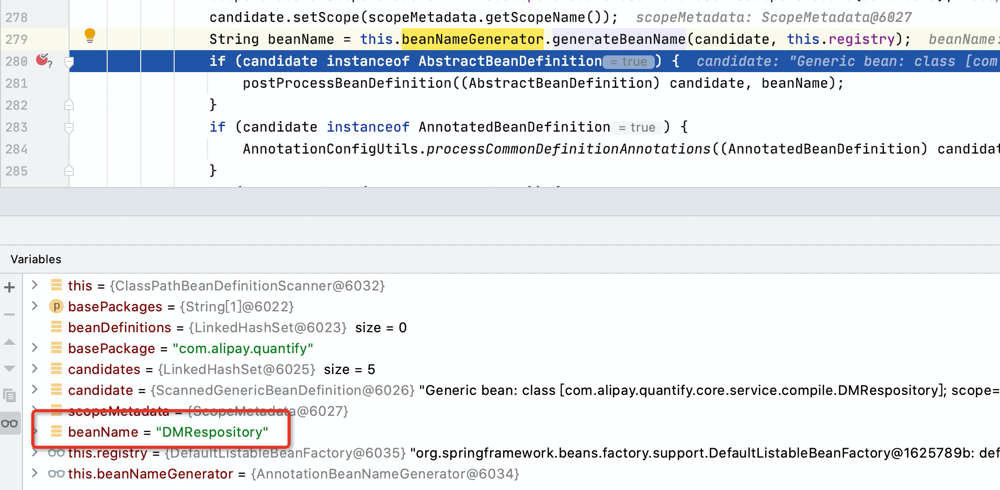

# Spring5 组件扫描
为了实现依赖项注入，Spring 创建了一个应用上下文（ApplicationContext）。Spring 实例化对象并将其添加到应用上下文中，应用上下文中的对象称为 Spring bean 或组件。Spring 解析 Spring bean 之间的依赖关系，并将Spring bean注入到其他Spring bean的字段或构造函数中。在类路径中搜索配置类的过程称为组件扫描<sup>[1]</sup>。

## @Component 注解
`@Component` 注解的类是 Spring 配置类，为了说明 Spring Boot 的组件扫描（component scan），先从 `@Component` 说起。 

以下是 `Component` 的注释中的内容：
>Indicates that an annotated class is a "component".
Such classes are considered as candidates for auto-detection
when using annotation-based configuration and classpath scanning.  
Other class-level annotations may be considered as identifying
a component as well, typically a special kind of component:
e.g. the {@link Repository @Repository} annotation or AspectJ's
{@link org.aspectj.lang.annotation.Aspect @Aspect} annotation.

主要表述了以下几点：
- 被 @Component 注解的类是 Spring 管理的组件；
- 当启用基于注解配置、类路径扫描时，被其注解的类会被自动检测的；
- 如果类被 @Repository、@Aspect 标记，也会被当做 spring 组件；

`@Component` 是通用的原型注解（stereotype annotation），其他原型注解，如 @Repository、@Service 和 @Controller 是 @Component 的特例化；  
`@Component`、`Repository` 、`Service` 和 `Controller` 均是由 `org.springframework.context.annotation.ClassPathBeanDefinitionScanner` 处理。

## Bean 的名称
AnnotationBeanNameGenerator 名字生成器，如果不指定 Component 的 value 属性，默认 bean name 为短类名，详见 `java.beans.Introspector#decapitalize`，例如

`java.example.MyRepository` 的 bean 名称为 myRepository  
`java.example.DTMRepository` 的 bean 名称为 DTMRepository

  

### 依赖注入的3种方式
- Constructor注入
- Setter注入（Field注入）
- 工厂方法注入

### bean 重复加载

如果需要允许 bean 重复加载，可以在 properties 中添加 `spring.main.allow-bean-definition-overriding=true` 配置

### 理解 stereotype 

[what-is-a-spring-stereotype](https://stackoverflow.com/questions/14756486/what-is-a-spring-stereotype)

## Auto-detection

`@ComponentScan` 或者 `<context:component-scan/>` 会开启 Spring 的类路径的自动扫描。

[Bean-classpath-scanning](https://docs.spring.io/spring-framework/docs/current/reference/html/core.html#beans-classpath-scanning)
>The use of <context:component-scan> implicitly enables the functionality of <context:annotation-config>. There is usually no need to include the <context:annotation-config> element when using <context:component-scan>.

## Auto-configuration

`@EnableAutoConfiguration` 是 SpringBoot 提供，不在 Spring Framework 核心包中，自动配置

>Spring Boot auto-configuration attempts to automatically configure your Spring application based on the jar dependencies that you have added. For example, if HSQLDB is on your classpath, and you have not manually configured any database connection beans, then Spring Boot auto-configures an in-memory database.

```Java 
@Target(ElementType.TYPE)
@Retention(RetentionPolicy.RUNTIME)
@Documented
@Inherited
@AutoConfigurationPackage
@Import(AutoConfigurationImportSelector.class)
public @interface EnableAutoConfiguration {

	String ENABLED_OVERRIDE_PROPERTY = "spring.boot.enableautoconfiguration";

	Class<?>[] exclude() default {};
	
	String[] excludeName() default {};
}
```

其中最重要的是 `@Import(AutoConfigurationImportSelector.class)` 注解，借助 `AutoConfigurationImportSelector`，`@EnableAutoConfiguration` 帮助 Spring Boot 应用将所有符合条件的 `@Configuration` 配置加载到当前IoC容器中。

而其中关键是 AutoConfigurationImportSelector 借助 Spring 的工具类 `SpringFactoriesLoader` 加载了 `META-INF/spring.factories` 配置，`spring.factories` 文件是一个典型的 properties 配置文件，格式仍然是 `Key=Value` 的形式，不过 Key 和 Value 均是 Java 的全限定类名，比如：`org.springframework.data.repository.core.support.RepositoryFactorySupport=org.springframework.data.jpa.repository.support.JpaRepositoryFactory`。

# REF
1. [spring-component-scanning](https://reflectoring.io/spring-component-scanning/)
2. [Annotation-based Container Configuration](https://docs.spring.io/spring-framework/docs/current/reference/html/core.html#beans-annotation-config)
3. [Auto-configuration](https://docs.spring.io/spring-boot/docs/current/reference/htmlsingle/#using.auto-configuration)